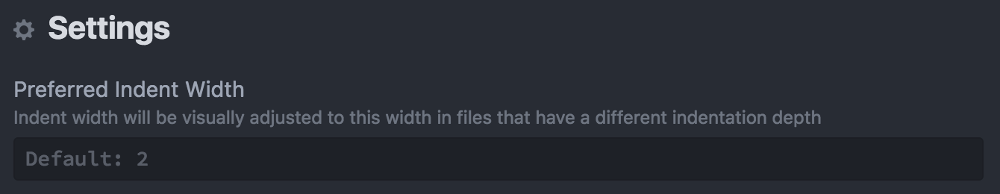

# Visual Indentation for Atom

Prefer 2-spaced, 3-spaced, 4-spaced or 42-spaced code layouts? Working on code (maybe at work, or open source) with a different indentation that you can't / shouldn't change?

`visual-indent` lets you set your preferred _visual_ indent width, and work in it without changing the physical indentation in a file. Indentation markers get a dynamically calculated width based on the indentation settings of the file.

Have your indentation cake, and eat it too!

### Install

:warning: `visual-indent` is unreleased and rough around the edges. It currently has a 10% black opacity background that shows for all resized indents for clarity on when resizing is occurring.

`apm install supermario/visual-indent`

Note: you may find [`auto-detect-indentation`](https://atom.io/packages/auto-detect-indentation) with "Show spacing in status bar" enabled to be useful if you frequently swap between indentation sizings.

### Settings

